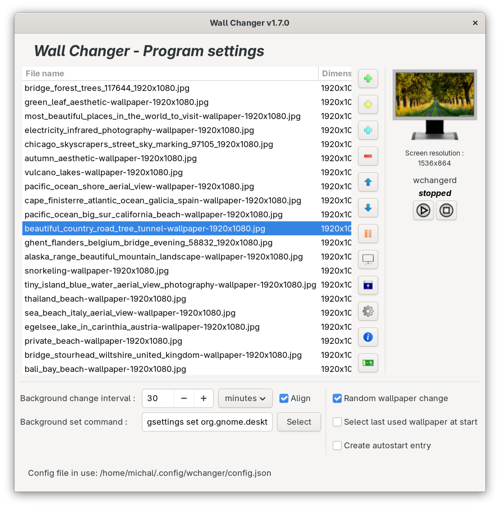
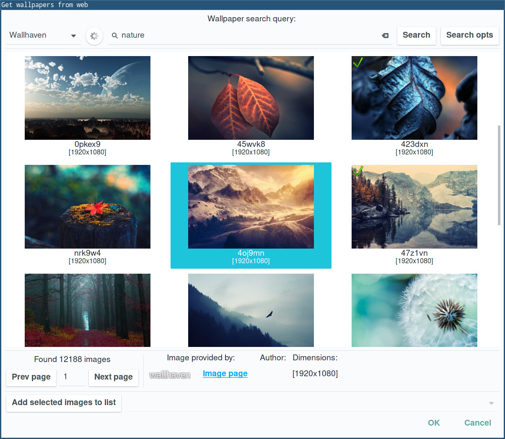

# Wall Changer

[](https://github.com/mi-bb/wallchanger/releases/)


## Contents

- [About](#about)
- [Requirements](#requirements)
- [Installation and running](#installation-and-running)
  - [Building with CMake](#building-with-cmake)
- [Contact and help](#contact-and-help)

## About

Wall Changer is an automatic wallpaper changer. The user can select
images to use as wallpapers, the command used to set the wallpaper, and
the wallpaper change interval.

The program works on GNU/Linux and FreeBSD.

### Supported wallpaper search pages:

 - Pixabay
 - wallhaven.cc
 - Wallpaper Abyss
 - Flickr





## Requirements

- GNU/Linux, FreeBSD
- A C23-capable compiler: GCC (>= 13) or Clang (>= 16)
- GTK+ 3 (>= 3.22)
- json-c (>= 0.12.1)
- libcurl (>= 7.68.0)

To build the program, CMake (>= 3.21) is required.

## Installation and running

### Building with CMake

The program is built with CMake (>= 3.21). Builds are always out-of-source
and write nothing into the checkout.

The quickest way is the bundled presets:

```
cmake --preset default
cmake --build --preset default
sudo cmake --install build
```

`default` builds `RelWithDebInfo` in `./build`; `release` builds optimized
with the prefix set to `/usr`; `debug` builds unoptimized with `-Wall
-Wextra`. Run `cmake --list-presets` to see them.

Without presets, the equivalent commands are:

```
cmake -S . -B build
cmake --build build
sudo cmake --install build
```

The build type defaults to `RelWithDebInfo`. To pick a different one, or
to set a custom install prefix:

```
cmake -S . -B build -DCMAKE_BUILD_TYPE=Release -DCMAKE_INSTALL_PREFIX=/usr
```

For a normal daily use of this program a good option should be:

```
cmake -S . -B build -DCMAKE_C_COMPILER=gcc \
    -DCMAKE_C_FLAGS="-march=native -O2 -pipe" -DCMAKE_INSTALL_PREFIX=/usr
```

- `-DCMAKE_C_COMPILER=gcc` — sets the C compiler (`clang` for Clang)
- `-march=native` — enables all instruction subsets supported by the local machine
- `-O2` — sets the code optimization to level 2
- `-pipe` — use pipes rather than temporary files for communication between the various stages of compilation
- `-DCMAKE_INSTALL_PREFIX=/usr` — where the app should be installed

The C standard does not have to be given by hand. The sources are C23, and
the build finds the option that enables it (`-std=gnu23` on compilers that
do not already default to C23) and stops with an explanatory message if the
compiler cannot provide C23 at all.

Unit tests are built automatically when the `check` library is found, and
can be run with:

```
ctest --test-dir build
```

To undo an install:

```
sudo cmake --build build --target uninstall
```

A source tarball for a release can be produced with:

```
cpack --config build/CPackSourceConfig.cmake
```

If compilation ends without problems, two executable files will be created:

```
wchangerd
wchangercfg
```

`wchangerd` works in the background and changes wallpaper at specified
time intervals.

`wchangercfg` is a configuration window to set the wallpaper change
interval, the list of wallpaper images, the way wallpapers change, etc.

Working with the `wchangerd` daemon:

```
wchangerd --start      Starts the wchangerd daemon
wchangerd --stop       Stops the wchangerd daemon
wchangerd --restart    Restarts the wchangerd daemon

wchangerd --once       Change wallpaper once and exit

wchangerd --config     Loads configuration from a given file
```

The wallpaper change command is selected based on the currently used
window manager. The application has default wallpaper change commands
for several window managers. Default commands can be changed through
`wchangercfg`, using the Select button. It opens a dialog for setting
the wallpaper command, with a list of window managers and commands.
After checking and setting commands, especially for Xfce, which has an
unusual wallpaper-set command, you can use this app with different
window managers without changing settings.

After changing settings using `wchangercfg`, the `wchangerd` daemon will
load them before the next wallpaper change. If you want to load settings
before that time, you need to restart the `wchangerd` daemon using the
`wchangerd --restart` command.

Default places for configuration file (the application will look for it
in order like on the list below):

```
~/.config/wchanger/config.json
~/.config/wchanger.json
~/.config/wchanger/wchanger.json
```

To use other than standard config path, use the `--config` option:

```
wchangerd --config [FILENAME]
wchangercfg --config [FILENAME]
```

## License

This project is licensed under the GPL-3.0 License — see [COPYING](COPYING) for details.
